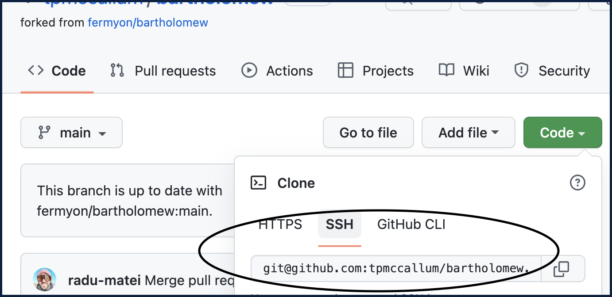
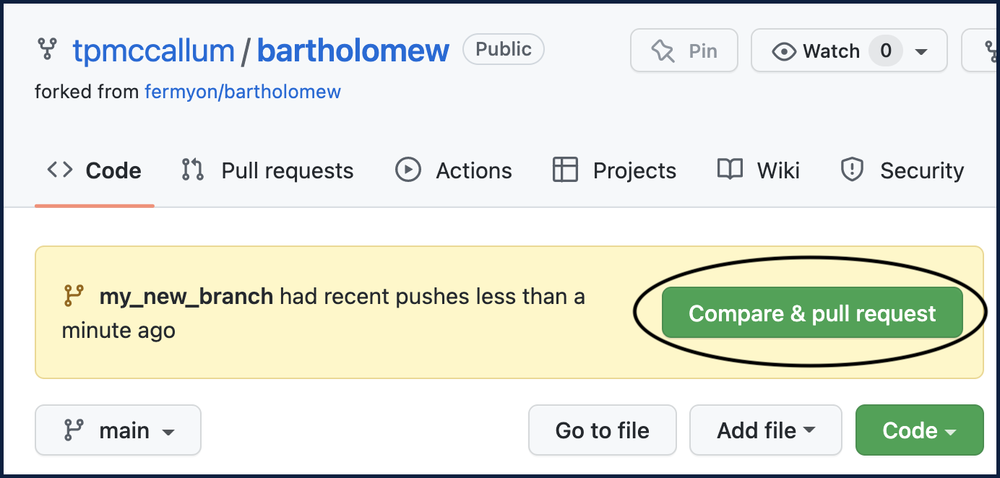

title = "Contributing to Bartholomew"
date = "2022-05-08T14:05:02.118466Z"

[extra]
url = "https://github.com/fermyon/bartholomew/blob/main/docs/content/contributing.md"
---

To contribute to the Bartholomew project, please follow these steps.

# Create a fork of the Bartholomew GitHub repository


Ensure that you are forking Bartholomew to **your own GitHub account**; where you have full editing privileges.

# Clone the fork

Set up a new environment on your system where you would like to work.

```bash
mkdir ~/my_bartholomew_contribution
cd ~/my_bartholomew_contribution
```

Then go ahead and clone the new fork that you just created (the one which resides in your own GitHub account).



```bash
git clone git@github.com:tpmccallum/bartholomew.git
```

Change into the new bartholomew directory (repo).

```bash
cd ~/my_bartholomew_contribution/bartholomew
```

# Create a new branch

Create a new branch which will house all of your changes in relation to this specific contribution.

```bash
git checkout -b my_new_branch
```

# Create a new remote for the upstream (a pointer to the original repository which you are contributing to)

```bash
git remote add upstream https://github.com/fermyon/bartholomew
```

# Modify your code and/or content

Now is the time to make any changes to the code base. This can include anything from updating files, creating new folders/files, writing documentation, writing tests, adding images and so much more. 

# Collaborating when submitting your code and/or content

Keep in mind that the developers who potentially merge your changes into the original repository will thoroughly check all of your work. There may be some back and forth as the final touches are added and your contribution is polished in readiness to deploy. Fermyon proudly hosts a [code of conduct](https://www.fermyon.com/code-of-conduct) document. Taking a few minutes of your valuable time to view this page would be greatly appreciated.

Also, when contributing, please ensure that you notice any unwritten conventions which are obvious. For example if an entire folder of images are named using underscores i.e. image_1.png, image_2.png ensure that you don't upload an image with a different format like Image3.png or image-4.png. The same applies for written code, keep an eye out for conventions such as camel case and so forth when creating new variables. This will surely make the collaboration process smoother and faster.

# Adding, commiting and pushing via GitHub

Once you are satisfied with your contribution, please ensure that your GitHub installation is configured sufficiently so that you can `--signoff` as part of the `git commit` command. For example, please ensure that the `user.name` and `user.email` are configured in your terminal. You can check if these are set by typing `git config --list`.

If you need to set these values please use the following commands.

```
git config user.name "yourname"
git config user.email "youremail@somemail.com"
```

## Add changes

Move to a top level directory, underwhich your changes exist i.e. `cd ~/my_bartholomew_contribution/bartholomew`.

Add your changes using the following command.

```bash
git add .
```

## Commit changes

Type the following commit command and ensure to sign off (`--signoff`) and also leave a short message (`-m`).

```bash
git commit --signoff -m "Updating documentation about testing process"
```

## Push changes

At this stage it is a good idea to just quickly check what GitHub thinks the `origin` is. For example, if we type `git remote -v` we can see that the origin is our own repo; which we a) forked the original repo into and b) which we then cloned to our local disk so that we could edit.

```bash
git remote -v
origin	git@github.com:tpmccallum/bartholomew.git (fetch)
origin	git@github.com:tpmccallum/bartholomew.git (push)
```

Next, we push the changes (explicitly mentioning the origin and also the new branch which we created in one of the earler steps in this tutorial).

```bash
git push -u origin my_new_branch
```

# Create a Pull Request (PR)

If you return to your GitHub repository in your browser, you will notice that a PR has automatically been generated for you.



Clicking on the green "Compare and pull request" button will send your contributions to the original repository for comment, review and merging.

Please keep an eye on the PR; answering any questions as part of the collaboration process.

# Merged

The final stage of a successfull contribution will be a notification that the PR has been merged.


## Thank you

At this point you have performed a significant amount of work which is greatly appreciated. 

Thank you for contributing!

Please keep in touch and contribute again in the future. We would love to see you back here.


